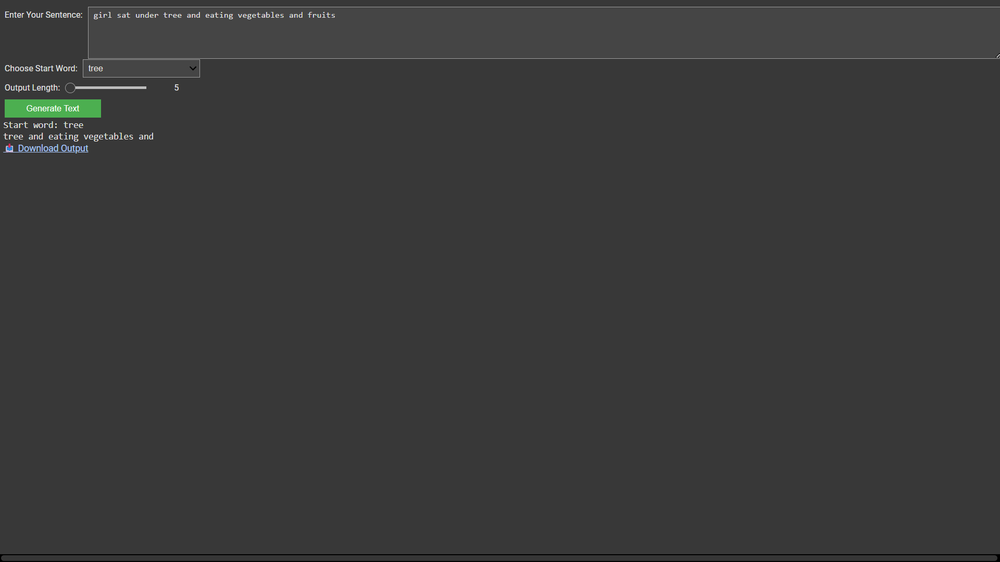

# PRODIGY_GA_03
An interactive Markov chain-based text generator built with Python and ipywidgets. Input a sentence, choose a starting word, and generate randomized text with a downloadable output—all inside a Jupyter notebook.
# 🧠 Markov Text Generator

An interactive Markov chain-based text generator built with Python and `ipywidgets`. Input a sentence, choose a starting word, and generate randomized text with a downloadable output—all inside a Jupyter notebook.

## 🚀 Features

- 📥 Custom sentence input
- 🔘 Start word dropdown (auto-filled)
- 🔢 Adjustable output length (5–100 words)
- ▶️ Generate button
- 📤 Downloadable `.txt` output

## 📸 Screenshot



> *Above: A preview of the interactive UI with sentence input, dropdown, slider, and output area.*

## ▶️ Try It Now

Launch the notebook instantly in Google Colab:  
[](https://colab.research.google.com/drive/13sIAX0aWEFIdYRAkpN5L3Xdjt2E-nh8n)

## 📦 Installation

To run locally:

```bash
git clone https://github.com/your-username/markov-text-generator.git
cd markov-text-generator
pip install ipywidgets notebook
jupyter notebook
